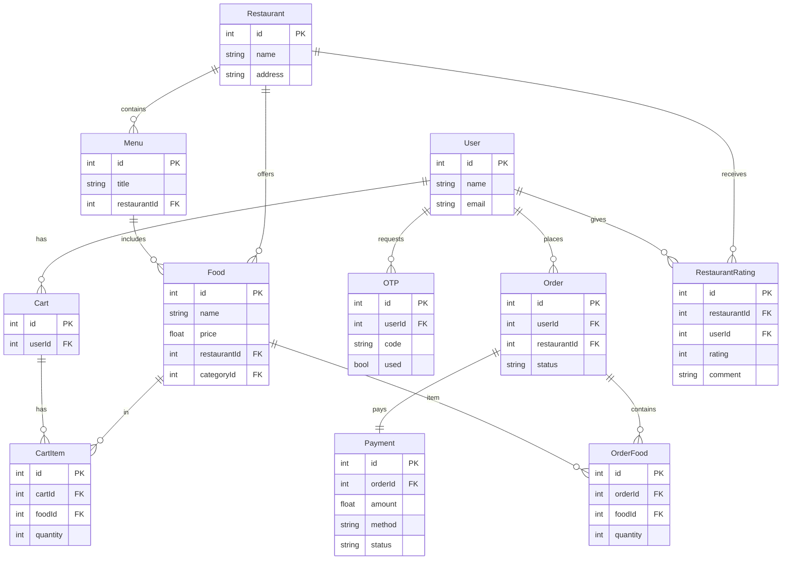

# Food Delivery Backend (NestJS)


## 🚀 Project Overview

This repository is a backend template for a food delivery app built with NestJS. It provides API modules for auth, users, restaurants, menu, cart, and orders. The code is structured for clarity, scalability, and quick extension.

## 🛠️ Tech Stack

- Node.js
- TypeScript
- NestJS
- Prisma ORM
- PostgreSQL (or compatible SQL)
- Jest (testing)

## ▶️ Run locally

1. Install dependencies:

```bash
npm install
```

2. Configure environment variables (`.env` or your value):

- `DATABASE_URL` (for Prisma)
- `JWT_SECRET`
- `JWT_EXPIRES_IN`

3. Run Prisma migrate + seed (if required):

```bash
npx prisma migrate dev --name init
npx prisma db seed
```

4. Start app in development:

```bash
bun install 
npm dev 
```

5. Production build + start:

```bash
bun run build 
bun run start 
```

## 📁 Folder structure

- `src/` - application source
  - `modules/` - features and endpoints
  - `bases/` - generic decorators, guards, filters, interceptors
  - `prisma/` - database module, service
  - `main.ts` - app bootstrap
- `prisma/` - schema and migrations
- `generated/prisma` - generated Prisma client models
- `test/` - e2e tests
- `scripts/` - helper scripts

## 🗂️ Relevant files

- `src/app.module.ts` - root module
- `src/main.ts` - application startup
- `src/modules/auth` - auth flow (JWT/local)
- `prisma/schema.prisma` - ER model
- `prisma/migrations` - DB history

## 🧩 Database diagram (Mermaid)



## 🧪 Tests

- Unit / e2e: `npm run test` or `npm run test:e2e`

## 📌 Notes

- Keep `prisma/generated` in sync: `npx prisma generate`.
- Use modern NestJS module-based design for new features.

---

> Simple, clean, and ready for production-grade extension.
